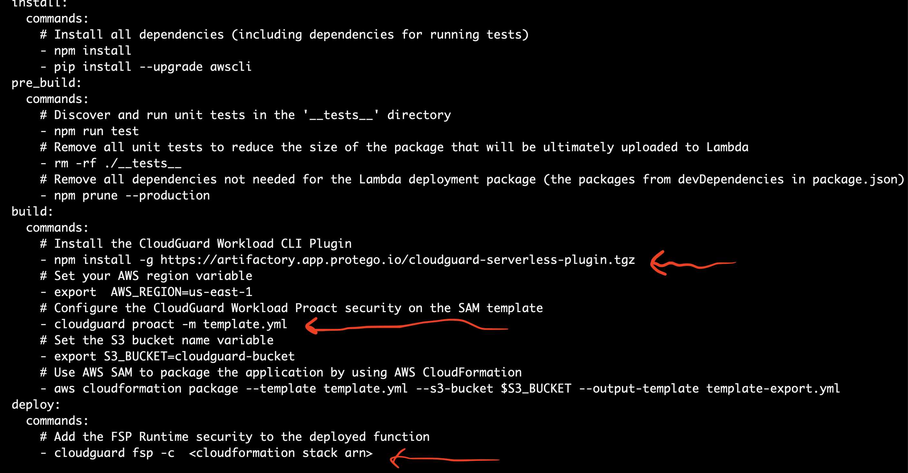
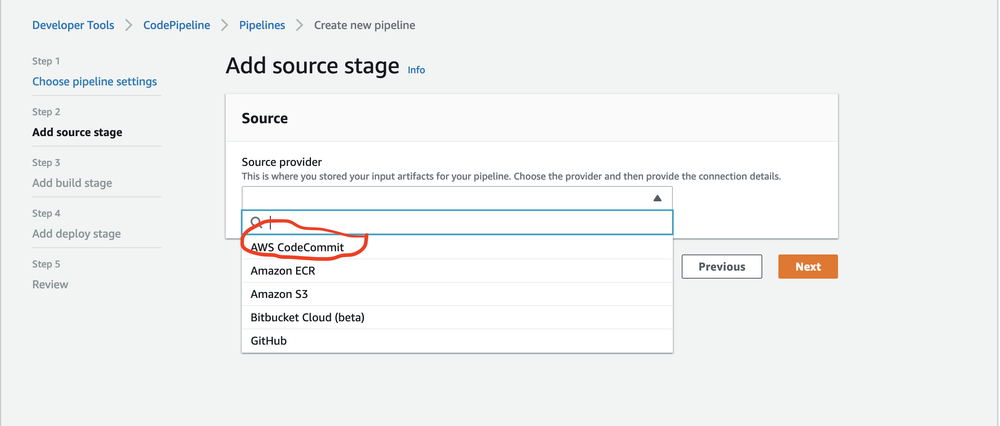
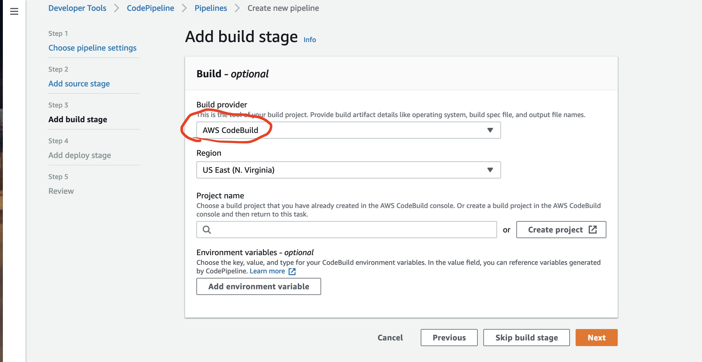
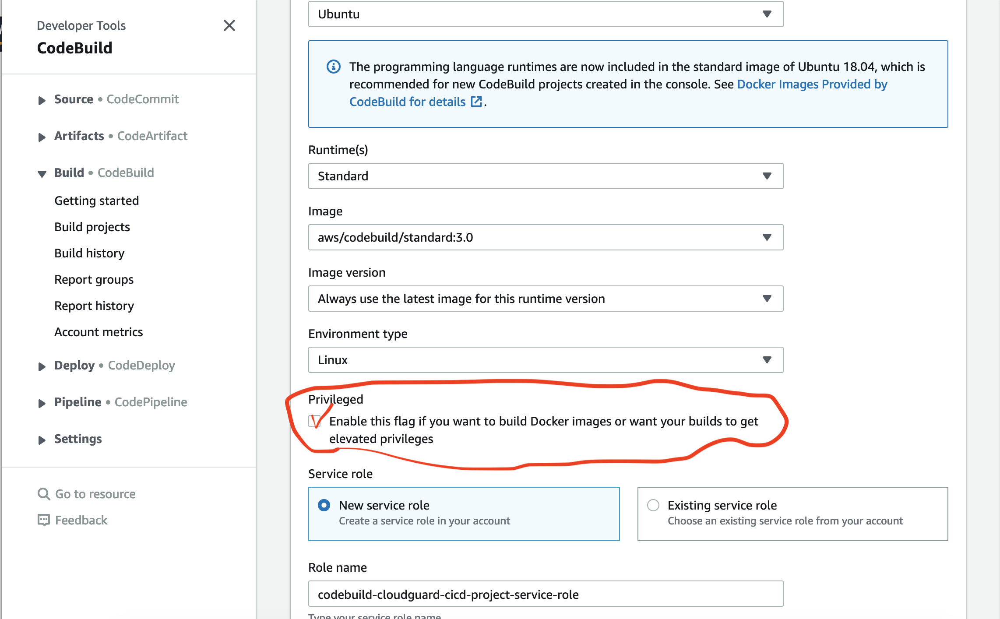
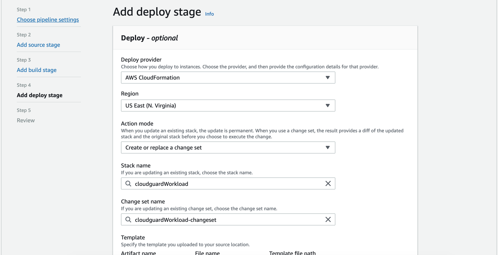

# Serverless CI/CD Security with AWS CodePipeline and Check Point CloudGuard Workload:
## Deploying and securing AWS Lambda functions with AWS CodePipeline and Check Point Serverless Security

Check Point CloudGuard Workload is the serverless security solution from Check Point Software. It will provides build, governeance and runtime securityfor serverless applications. 
The Build and Governance security are implemented with Proact which does static scanning analysis of the code and FSP(function Selfv protection) which does runtime security by wbhitelisting the behavior of the application. CloudGuard workload can be integrated in any CI/CD pipeline with plugins available either via SAM or CLI for example. 
In this tutorial, we will be using AWS CodePipeline to deploy a serverless application and add Cloudguard workload as a step in the build and deploy phases of the CI/CD pipeline. We will show how to build a simple Lambda function using the AWS SAM(Serverless Application Model) CLI and then create a CICD pipeline with AWS CodePipeline to build, secure and deploy that Lambda function. We will integration the Cloudguard Workload serverless security to AWS CodePipeline using the cli plugin to perform Governance, Deep code analysis and Runtime application security. The proact feature perform the posture management check and SAST while the Function Self Protection performs the runtime security or RAST.
It is important to note that there are other methods besides SAN to build and package a lambda function such as the Serverless framework. please refer to my Tutorial using the Open Serverless Framework. For more information about AWS Codepipeline https://aws.amazon.com/codepipeline/

  
 
## Prerequesites:
On your laptop, please install the following:

> Install AWS CLI https://docs.aws.amazon.com/cli/latest/userguide/install-cliv2.html
> Install SAM CLI https://docs.aws.amazon.com/serverless-application-model/latest/developerguide/serverless-sam-cli-install.html
> Install Git https://git-scm.com/book/en/v2/Getting-Started-Installing-Git
> Please note that I will be using MacOS in this tutorial and feel free to use any OS of your choice.

The AWS CodePipeline create a CICD pipeline to build and deploy a Lambda function. we will using the SAM cli to generate the source code for the Lambda and needed templates for the AWS Codepipeline as follow. 
In a CICD pipeline, there are 4 main stages from build to Runtime. Additional stages for staging and testing can be added as required by the Software development lifecycle.

## This tutorial will teach you step by step how to create a AWS Codepipeline with CloudGuard Workload Serverless security:
we will configure various ressources:
Create a Repository on your laptop using Git and on AWS using AWS CodeCommit or GitHub. When a change or a commit is made it will be passed to an S3 bucket and then to Code Build
A Build Project in AWS CodeBuild to checkout the code from AWS CodeCommit and package it. This includes the source code in a handler.js file, the SAM template yaml file and the Build specification yaml file or Buildspec.yaml. The Buildspec file defines flow of the various commands needed in each CICD stage in order to package and deploy the application using the SAM template. The CloudGuard serverless security will be integrated in CodeBuild with the Buildspec file using the CLI plugin.
AWS CodeDeploy will use a CloudFormation Changeset to deploy the Lambda function. A cloudFormation stack will be needed to create a changeset and if you are not able to write a stack template, we will use the SAM deploy code to create one.
IAM roles for all these AWS services will have to be created and needed permissions will have to be added for the CICD pipeline to execute successfully from build to deploy.
lets get started!
We will first use SAM to create a serverless project named here cloudguard-app for a node.js12.x serverless application. This will create a directory that I named ./cloudguard-app but you can name the SAM project directory anything you want..

 

## The following ressources were generated as below:

**buildspec.yml** this file is used by AWS CodeBuild to define the build stage steps to package your application for deployment to AWS - - Lambda and add the cloudguard workload build and runtime security with proact and FSP(Function Self Protect)

**index.js** this file contains the sample Node.js 12.x code for the web service

**template.yml** A template that defines the application's AWS resources

**tests/** this directory contains unit tests for your application

The Application is a simple node.js 12.x application that will return a string when invoked ..'Serverless app secured by CloudGuard Workload!
 

The SAM template or template.yml defines the serverless application: 
 

The build specification file or Buildspec.yml defines the required packages and uploads the deployment package to a Amazon S3 bucket.
You will have to create a AWS S3 bucket and add its name to the file and add the CloudGuard Workload CLI plugin to define Proact or the governance and static code scanning as well as the runtime application security testing with the Fuction Self Protection or FSP.
Lets first create the S3 bucket: 
 

Add CloudGuard Workload security using the CLI plugin and configure the proact and the fsp. Please refer the annotations in the build and deploy stages or phases: 
 

Its now time to intialize your project directory with Git, commit all the files a.
I am using AWS CodeCommit.If AWS Codecommit, you will first need to add CodeCommit IAM permissions on your AWS account in order to be able to push.
 

And push all the commited files to your Github or AWS CodeCommit repository. I will be using AWS CodeCommiy.
 

 

We are now ready to create the AWS CodePipeline at the CodePipeline service menu.
Enter a name for your pipeline. you can keep the rest settings as default as a IAM role for the codepipeline will be created
 

Then chose your repository and branch ..in our case the repository you created and the default branch master
 

 

For Build provider, choose AWS CodeBuild, and then choose Create project.
 

### Configure build project settings and choose Continue to CodePipeline.

* Project name – <your project name> in my case cloudguard-project

* Operating system – Ubuntu

* Runtime – Standard

* Runtime version – aws/codebuild/standard:3.0 ( The app is node.js 12.x requiring ver3.0)

* Image version – Latest

* Buildspec name – buildspec.yml

> **Please note the CodeBuild IAM role name as you will have to add permissions to allow access to all needed AWS ressources or the pipeline will FAIL..
> codebuild-cloudguard-cicd-project-service-role

 

### We now move to the Deploy stage and we will CloudFormation as the Deploy provider

 
